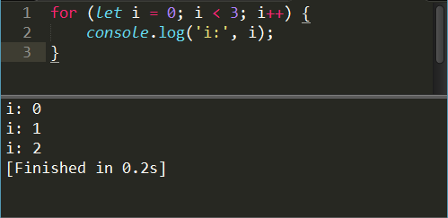

title: 在sublime中运行JavaScript脚本
---
sublime是一款轻量级的文本编辑器，非常受大家的欢迎，它不仅启动迅速，还提供非常丰富的插件供大家扩展功能。对于我个人来讲，我非常喜欢用sublime编写单个的脚本文件。但是前端的小伙伴们知道，如果编写js脚本，要编译运行的话必须在浏览器或者是node中运行，虽然不麻烦，但总归还是会消耗一些时间，对于一些简单的脚本，我们想能够立即看到脚本运行的结果，那么今天我就介绍一个可以直接在sublime中运行js脚本文件的方法。

<!--more-->
下面是详细的步骤：
#### 安装node
在[node.js的官网](https://nodejs.org/en/)下载并安装node.js，请确保你的node已经被添加到了环境变量中（这一步非常简单就不多说了，网上有很多教程请自行查阅）。

#### 添加 build system
现在打开你的sublime，然后依次打开 Tools -> Build System -> New Build System，黏贴以下代码：
```JSON
{
    "cmd": ["node", "--use-strict", "--harmony", "$file"],
    "selector": "source.js"
}
```
然后保存，这个时候sublime会自动识别并跳到build system的保存目录，取一个你喜欢的名字，比如JavaScript.sublime-build（这样方便识别），确定保存。

另：上面的代码默认使用的是严格模式，并且支持ES6的新特性，如果你不想使用这些功能，可以使用下面的代码
```JSON
{
    "cmd": ["node", "$file"],
    "selector": "source.js"
}
```

#### 开始使用吧！
保存好之后打开你的sublime，在tool中选择build system，你就会看到那个刚刚你取名字的编译系统，选择它。

新建一个js文件，写上js代码，比如：
```js
for (let i = 0; i < 3; i++) {
    console.log('i:', i);
}
```

保存，然后按下`ctrl+B`，就可以看到运行结果了。



是不是非常的神奇呢！！
