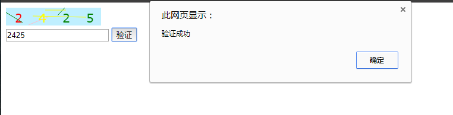

title: 用canvas制作一个简单的随机验证码
---
现在验证码在网页表单中几乎是标配，用来防止机器人攻击网站，今天我们就用canvas和js来写一个简单的随机二维码。
<!-- more-->
#### 制作思路
大家知道canvas是HTML5里面的新特性，可以用来绘图，配合js可以绘制出各种各样的图案。验证码一般由数字或字母组成，再加上一些视觉干扰的元素，防止机器人识别。而canvas可以绘制文字及线条，还可以做一些旋转处理，利用这些特性我们就可以做出一个简单的随机验证码。

#### 代码
```html
<!DOCTYPE html>
<html>
<head>
	<title></title>
</head>
<body>
	<canvas width="200" height="30" id="myCanvas"></canvas>
	<br>
	<input type="text" name="" placeholder="请输入验证码" id="input">
	<button onclick="check()">验证</button>
</body>
<script type="text/javascript">
	var c=document.getElementById("myCanvas");
	var ctx=c.getContext("2d");
	ctx.fillStyle="#BFEFFF";//绘制背景颜色
	ctx.fillRect(0,0,160,30);

	//随机产生4个字符
	var chars = [];
	for(var i = 0;i < 4;i++){
		chars.push(Math.floor(Math.random()*9).toString());
	}


	ctx.font="20px Verdana";

	var x = 15;
	var colors = ['red','yellow','blue','green','pink','black'];
	//绘制4个字符
	for(i = 0;i < 4;i++){
		ctx.fillStyle = colors[Math.floor(Math.random()*5)];
		ctx.fillText(chars[i],x,25);
		x = x + 40;
	}

	//对图案随机加入线条造成干扰
	var lineNumber = 5; // 线条条数
	var lineX = 160;
	var lineY = 30;  // 最大线条坐标
	for(i = 0;i < lineNumber;i++){
		ctx.strokeStyle = colors[Math.floor(Math.random()*5)];
		ctx.beginPath();
		ctx.moveTo(Math.floor(Math.random()*lineX),Math.floor(Math.random()*lineY));
		ctx.lineTo(Math.floor(Math.random()*lineX),Math.floor(Math.random()*lineY));
		ctx.stroke();
	}

    // 点击按钮验证
	function check(){
		var input = document.getElementById('input').value;
		if(input === chars.join('')){
			alert("验证成功");
		}
		else{
			alert('验证失败');
		}
	}

</script>

</html>

```

最后的效果：（每一次刷新后的图案都是不同的）


当然这里使用的是数字，你也可使用字母或数字字母混用。在干扰方面，你还可以加上旋转，缩放，虚化等等，这些效果用canvas同样可以实现。

以上。
